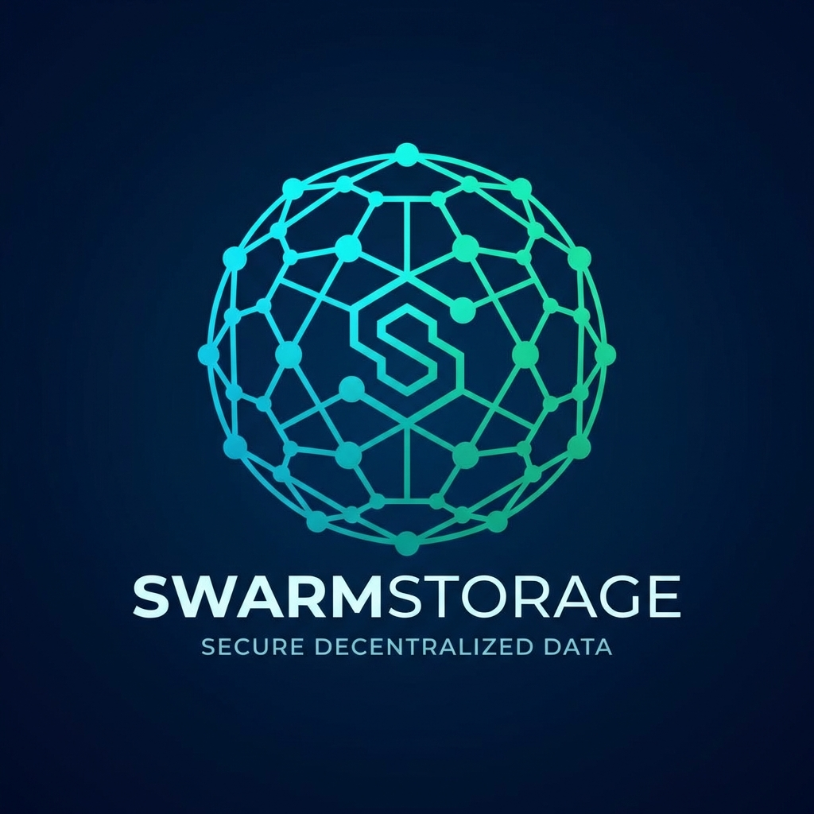

<div align="center">
  
  <h1>SwarmStorage</h1>
  <p><strong>Private IPFS Storage Cluster</strong></p>
</div>

## Overview

SwarmStorage is a decentralized, private storage solution designed for secure and redundant data management. It leverages a custom engine named **Laria** to ensure data durability and confidentiality through advanced sharding and encryption techniques.

## Key Features

- **Private & Secure**: Data is encrypted and distributed across a private cluster.
- **High Availability**: Resilient to node failures via Reed-Solomon erasure coding.
- **Distributed Architecture**: Decentralized storage nodes participating in a swarm.
- **Reward System**: Incentive mechanism for nodes verifying and storing data shards.

## Laria Engine

Laria is the core storage engine powering SwarmStorage. It handles the complexity of file splitting, encryption, and reconstruction.

### How it Works

1.  **Encryption & Padding**: Files are encrypted and padded to ensure the total size is a multiple of **4 MB** (Atomic Shard Size).
2.  **Sharding (Reed-Solomon 8, 5)**:
    - The data is split into **20 MB** stripes (Data Stripe Size).
    - Each stripe is divided into **5 data shards** and **3 parity shards** using Reed-Solomon (8, 5) erasure coding.
    - Each shard is **4 MB** in size.
3.  **Distribution**: The 8 shards are distributed to different storage nodes in the network.
4.  **Metadata**: A metadata file is generated containing file info and shard locations, which is then stored in the warehouse.

### Recovery
- To recover a file, only **5 out of 8** shards are required. This allows the system to tolerate the loss of up to 3 shards (nodes) without data loss.

## Tech Stack

- **Frontend/Framework**: [Next.js 16](https://nextjs.org/)
- **UI Library**: [React 19](https://react.dev/)
- **Styling**: [Tailwind CSS 4](https://tailwindcss.com/)
- **Blockchain Interaction**: [Ethers.js](https://docs.ethers.org/v6/)
- **Containerization**: Docker

## Getting Started

### Prerequisites
- Docker
- Node.js 22

### Installation & Run

```shell
# Install dependencies
npm install

# Start IPFS and local services
docker compose up -d

# Run the SwarmStorage service (Production build)
npm run swarm
# OR for development
npm run dev
```

## API Reference

### Upload File
**POST** `/api/v1/file`

Uploads a file to the swarm. The file will be processed by the Laria engine.

### Download File
**GET** `/api/v1/file/:cid`

Downloads a file or shard by its Content Identifier (CID). If the CID points to an encrypted file metadata, Laria will automatically attempt to fetch shards and reconstruct the original file.

